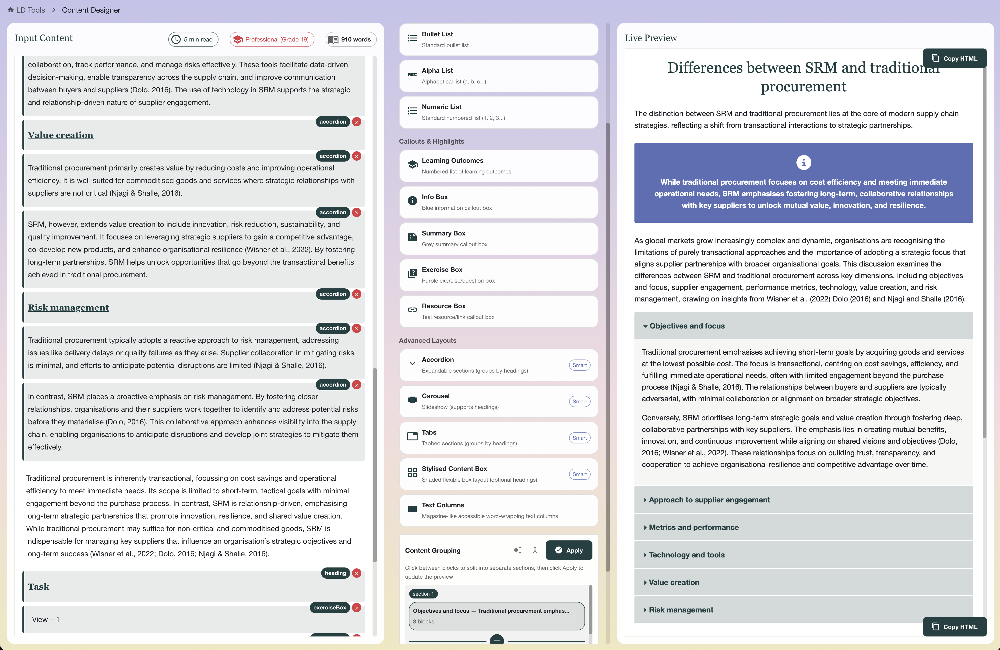

# Content Designer

A React-based tool for transforming plain text and Word content into beautifully formatted, accessible learning materials with interactive design components.

## About

Bugs and all, I'm adding this to GitHub in case other people can take it and improve upon it. I've had this idea for years that I'd like to build some sort of speed-boosting app for formatting learning material for Moodle, but I've never had the time or brain power. Finally, with LLMs becoming popular, I was able to rapidly generate an app and then perform several iterations to smooth things out. I realise this is not a perfect app, but it doesn't have to be at this point. The aim is really just to help a learning designer paste in ready-to-go content from Word Docs and apply some interactive formatting as quick as possible. The styling is based on my institution's branding, but the app could be customised to parameterise much of this. Cheers, Rolley


*Transform educational content with intelligent formatting suggestions*

## Features

### 🎨 Smart Content Recognition
- Automatically detects and suggests appropriate design components based on content
- Identifies learning objectives, summaries, exercises, and more
- NLP-powered reading level analysis and word count statistics

### 📝 Rich Design Components
- **Headings & Titles**: Module titles and styled headings
- **Learning Outcomes**: Numbered objective lists with custom styling
- **Callout Boxes**: Info, summary, exercise, and resource boxes
- **Lists**: Bullet, numeric, alphabetic, and icon lists with indentation support
- **Advanced Layouts**: Accordions, carousels, tabs, and stylised content boxes
- **Text Columns**: Magazine-style accessible column layouts

### ✨ Interactive Features
- Real-time live preview with Bootstrap and Font Awesome integration
- Paste directly from Microsoft Word with preserved formatting
- Customisable split points for multi-section components
- List indentation control with visual preview
- Icon and colour customisation for icon lists
- One-click HTML export

### 📊 Content Analysis
- Reading time estimation
- Multiple readability scores (Flesch-Kincaid, Gunning Fog, SMOG, Coleman-Liau, ARI)
- Grade level assessment
- Sentence and word complexity analysis

## Getting Started

### Prerequisites
- Node.js (v16 or higher)
- npm or yarn

### Installation

1. Clone the repository:
```bash
git clone https://github.com/ticknerr/content-designer.git
cd content-designer
```

2. Install dependencies:
```bash
npm install
```

3. Start the development server:
```bash
npm run dev
```

4. Open your browser to `http://localhost:5173`

## Usage

### Basic Workflow

1. **Input Content**: Paste your content from Word or type directly into the input area
   - Formatting (bold, italic, underline) is preserved
   - Lists and headings are automatically detected

2. **Select Blocks**: Click on a block or drag to select multiple blocks

3. **Apply Components**: Choose from the design components panel
   - Suggested components appear with a "Suggested" badge
   - Preview updates in real-time

4. **Customise**: 
   - Use split controls for accordions, tabs, and carousels
   - Adjust list indentation levels
   - Customise icon lists with different icons and colours

5. **Export**: Click "Copy HTML" to copy the formatted HTML to your clipboard

### Keyboard Shortcuts

- `Enter`: Split a block into two paragraphs
- `Ctrl/Cmd + V`: Paste content with preserved formatting

## Component Guide

### Single-Block Components
- **Module Title**: Large centred title for module headers
- **Styled Heading**: Formatted heading with proper styling

### Multi-Block Components
- **Learning Outcomes**: Automatically formats objectives with numbered circles
- **Info Box**: Blue informational callout (with optional title)
- **Summary Box**: Grey summary callout (with optional title)
- **Exercise Box**: Purple exercise/question box (with optional title)
- **Resource Box**: Teal resource/link box (with optional title)

### List Components
- **Icon List**: Customisable Font Awesome icons with colour options
- **Numbered List**: Styled numbered list with circular backgrounds
- **Bullet List**: Standard bullet points
- **Alpha List**: Alphabetical list (a, b, c...)
- **Numeric List**: Standard numbered list (1, 2, 3...)

All lists support nested indentation up to 3 levels.

### Advanced Layouts
- **Accordion**: Expandable sections (auto-groups by headings)
- **Carousel**: Slideshow with navigation controls
- **Tabs**: Tabbed content sections
- **Stylised Content Box**: Flexible multi-column layout
- **Text Columns**: Magazine-style word-wrapping columns

## Project Structure

```
content-designer/
├── components/          # React components
│   ├── TextInput.jsx           # Main content editor
│   ├── DesignComponentsList.jsx # Component selection
│   ├── LivePreview.jsx         # HTML preview
│   ├── SplitControl.jsx        # Multi-section grouping
│   ├── ListIndentControl.jsx   # List indentation
│   ├── IconListCustomisation.jsx # Icon customisation
│   ├── NLPAnalysis.jsx         # Content analysis
│   └── CopyButton.jsx          # HTML export
├── config/              # Configuration
│   ├── htmlTemplates.js        # HTML component templates
│   └── theme.js                # MUI theme configuration
├── hooks/               # Custom React hooks
│   └── useContentProcessor.js  # Content processing logic
├── utils/               # Utility functions
│   ├── contentClassifier.js    # AI content suggestions
│   ├── contentGrouper.js       # Multi-section grouping
│   ├── htmlGenerator.js        # HTML generation
│   ├── htmlUtils.js            # HTML manipulation
│   └── textParser.js           # Content parsing
└── App.jsx              # Main application
```

## Technologies Used

- **React 18** - UI framework
- **Material-UI (MUI)** - Component library
- **compromise** - Natural language processing
- **DOMPurify** - XSS protection
- **Bootstrap 4.5** - Preview styling
- **Font Awesome 6** - Icons
- **Vite** - Build tool

## Browser Support

- Chrome/Edge (recommended)
- Firefox
- Safari

Note: The contentEditable features work best in Chromium-based browsers.

## Development

### Build for Production

```bash
npm run build
```

The production build will be in the `dist/` directory.

### Code Style

The project follows standard React conventions:
- Functional components with hooks
- PropTypes for type checking (future enhancement)
- Modular utility functions
- Separation of concerns between UI and logic

## Known Limitations

- Content editor requires modern browser with full contentEditable support
- Very large documents (>10,000 words) may experience performance issues
- List detection from plain text is heuristic-based and may need manual adjustment

## Future Enhancements

- [ ] TypeScript migration for better type safety
- [ ] Undo/redo functionality
- [ ] Save/load projects to browser storage
- [ ] Export to other formats (PDF, Markdown)
- [ ] Custom component templates
- [ ] Collaborative editing
- [ ] Accessibility checker

## Contributing

Contributions are welcome! Please feel free to submit a Pull Request.

1. Fork the repository
2. Create your feature branch (`git checkout -b feature/AmazingFeature`)
3. Commit your changes (`git commit -m 'Add some AmazingFeature'`)
4. Push to the branch (`git push origin feature/AmazingFeature`)
5. Open a Pull Request

## License

This project is licensed under the MIT License - see the LICENSE file for details.

## Acknowledgements

- Bootstrap for preview styling
- Font Awesome for icons
- Material-UI team for the component library
- compromise.js for NLP functionality

## Support

For issues, questions, or suggestions, please open an issue on GitHub.

---

Made with ❤️ for educators and instructional designers